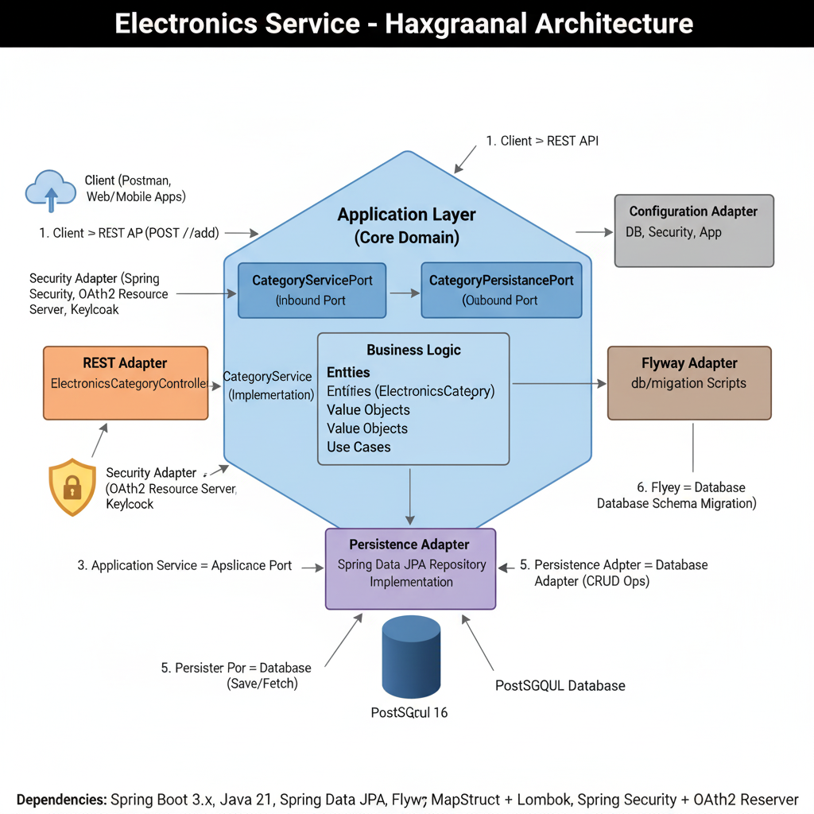

📦 Electronics Management System – Hexagonal Architecture (Spring Boot + PostgreSQL)

This project is a backend system for managing electronic categories (e.g., mobile, laptop, TV) using Spring Boot, PostgreSQL, JPA, and Flyway.

Unlike a typical CRUD app, this system follows a Hexagonal Architecture (Ports & Adapters), making it modular, testable, and enterprise-ready.

🚀 Key Features

✅ Hexagonal Architecture: Clean separation between Domain, Application (Use Cases), and Infrastructure.

✅ Domain-Driven Design: Business logic lives in the core domain layer, independent of frameworks.

✅ Ports & Adapters:

Input Port: ElectronicsCategoryModifierUseCase defines business contracts.

Output Port: ElectronicsCategoryModifierPersistencePort abstracts database access.

Adapters: REST Controller (input) + JPA Repository (output).

✅ Persistence Layer with PostgreSQL, JPA/Hibernate, Flyway migrations.

✅ Transaction Management using a custom @Transactional annotation with AOP.

✅ MapStruct for clean and automatic mapping between Domain Models and Entities.

🏛️ Architecture Overview
1. Domain Layer (Core)

Pure business rules, independent of frameworks.

Entity: ElectronicsCategoryDomainModel.

Ports:

Input Port: ElectronicsCategoryModifierUseCase → Defines use cases (create, update, get, list).

Output Port: ElectronicsCategoryModifierPersistencePort → Abstracts persistence.

2. Application Layer (Use Cases)

Implementation: ElectronicsCategoryModifierUseCaseImpl.

Orchestrates the flow between input ports and output ports.

Keeps the domain logic clean and isolated.

3. Infrastructure Layer (Adapters)

Input Adapter: REST Controller (ElectronicsCategoryController) → Exposes APIs (/el) for clients.

Output Adapter: Persistence Adapter (ElectronicsCategoryModifierPersistencePortImpl) → Bridges JPA Repository and Domain.

Repository: ElectronicsCategoryRepository (Spring Data JPA).

Mapper: ElectronicsCategoryDomainEntityMapper (MapStruct).

Database: PostgreSQL (managed with Flyway).

4. Cross-Cutting Concerns

Custom AOP @Transactional annotation with TransactionAspect.

Clean handling of transactions across domain logic.

